# HorizonBank_Project
<b><h2>🏦 Projet : "Horizon Banking Data Integrity & Insights"</h2></b> 
<b><h3>📝 Présentation du projet</h3></b> 
Ce projet simule le cycle complet de travail d'un Analyste de Données au sein d'une institution financière internationale. L'objectif était de transformer des données bancaires brutes et fragmentées en un outil de pilotage interactif permettant de surveiller la santé financière de la banque et le profil de risque des clients. 

<b><h3>🛠️ Stack Technique</h4></b>
Base de données : SQL Server (MS SQL) 

Langages : T-SQL (DDL, DML, DQL) 

Visualisation : Microsoft Excel (Tableaux Croisés Dynamiques, Power Pivot, Segments) 
 
<b><h3>⚙️ Étapes de réalisation</h4></b> 
<b><h4>1. Architecture & Ingestion (SQL)</h4></b> 
Conception d'un schéma relationnel complet comprenant 6 tables interconnectées : 

Agences & Employés : Gestion de la structure organisationnelle. 

Clients & Comptes : Suivi des profils et des soldes bancaires. 

Transactions & Prêts : Analyse des flux monétaires et des engagements financiers. 

Compétences : Clés primaires/étrangères, contraintes d'intégrité, types de données monétaires précis. 
 
<b><h4>2. Nettoyage & Standardisation (Data Cleaning)</h4></b> 
Traitement des anomalies critiques pour garantir la fiabilité des analyses : 

Normalisation des noms et des pays (gestion de la casse et des formats). 

Traitement des valeurs nulles (Emails, coordonnées). 

Standardisation des flux financiers (Conversion des montants négatifs en valeurs absolues via ABS()). 

Compétences : Manipulation de chaînes de caractères, Transactions SQL (COMMIT/ROLLBACK). 

<b></h4>3. Analyse & Intelligence d'Affaires</h4></b> 
Extraction d'indicateurs clés de performance (KPIs) via des requêtes avancées : 

Segmentation Clients : Utilisation de clauses CASE WHEN pour classer les clients selon leur score de crédit. 

Top Transactions : Mise en œuvre de CTE (Common Table Expressions) et de fonctions de fenêtrage (RANK) pour isoler les plus gros mouvements par compte. 

Performance Régionale : Agrégation des soldes par zone géographique. 

<b><h4>4. Visualisation (Dashboard Excel)</h4></b> 
Création d'un tableau de bord interactif comprenant : 

Indicateurs Flash : Solde total, Score de crédit moyen, Taux de clients à risque. 

Analyse de Répartition : Segmentation des scores de crédit via un graphique en anneau (Donut Chart). 

Analyse Comparative : Volume des soldes par région et top transactions clients. 

Interactivité : Intégration de segments (Slicers) pour un filtrage dynamique par région et par nom. 
 
Phase 1 : Ingestion et Schéma (Le socle) 
Avant d'analyser, il faut construire. On vas devoir créer l'architecture capable de recevoir nos données clients, comptes et transactions. 
 
Compétences visées : DDL (Data Definition Language), Types de données, Contraintes d'intégrité. 
 
Phase 2 : Data Cleaning & Standardisation (Le nettoyage) 
C'est ici que 80% du travail d'un analyste se passe. Les données brutes contiennent des doublons, des formats de dates incohérents et des valeurs nulles critiques.
 
Compétences visées : DML (UPDATE, DELETE), Fonctions de chaînes, Gestion des NULLs.
 
Phase 3 : Business Intelligence & Analyse (L'extraction) 
Le board de la banque veut des réponses : Qui sont nos clients les plus rentables ? Quel est le volume de risque ?
 
Compétences visées : Agrégations complexes (GROUP BY), Jointures (JOIN), CTE (Common Table Expressions).
 
Phase 4 : Optimisation & Sécurité (La déontologie) 
Un analyste assermenté doit garantir que les requêtes sont rapides et que les données sensibles sont protégées.
 
Compétences visées : Indexation, Vues (Views).
 
<b><h3>📋 ÉTAPE 1 (Ingestion)</h3></b> 
Pour commencer, nous devons monter l'infrastructure de test sur SSMS. Nous allons créer une base de données nommée HorizonBank_DB et d'y intégrer six tables spécifiques.
 
Attention : C'est à nous de définir les types de colonnes appropriés (INT, VARCHAR, DECIMAL, DATE, etc.) et les Clés Primaires (PK) et les clés secondaires (FK)
 
1. Table Branches (Les Agences) 
BranchID (PK) 

Nom_Agence, Ville, Region 

2. Table Employees (Les Conseillers) 
EmployeeID (PK) 

BranchID (FK vers Branches) 

Nom_Complet, Poste, Date_Embauche 

3. Table Customers (Les Clients) 
CustomerID (PK) 

EmployeeID (FK vers Employees - Chaque client a un conseiller attitré) 

Nom_Complet, Email, Telephone, Date_Naissance, Pays, Score_Credit 

4. Table Accounts (Les Comptes) 
AccountID (PK) 

CustomerID (FK vers Customers) 

Type_Compte (Courant, Épargne, etc.) 

Solde (Attention au type de donnée pour la monnaie !),

Date_Ouverture, Statut 

5. Table Transactions (Les Flux) 
TransactionID (PK) 

AccountID (FK vers Accounts) 

Date_Transaction, Montant, Type_Transaction

6. Table Loans (Les Prêts - Nouvelle table cruciale) 
LoanID (PK) 

CustomerID (FK vers Customers) 

Montant_Pret, Taux_Interet, Duree_Mois, Date_Debut, Statut_Pret
 
Livrable attendu pour cette tâche : 
Le script SQL complet (DDL) de création de ces tables. On va s'assurer que leses choix de types de données sont optimaux pour une banque internationale (notamment pour les montants financiers et la précision). 
  

    
  

 
<b><h3> 1-📋 Diagnostic Expert (Phase 2) </h3></b> 
Maintenant que nous avons de la donnée, le Board veut un "Data Quality Report". Cette partie est juste une découverte des données . Savoir quel sont les valeurs des colonnes qu'on peut nettoyer pour rendre les fichiers exploitables .Nous allons utiliser les connaissances (SELECT, JOIN, WHERE) pour sortir les listes suivantes:
 
Le test de la casse (Case Sensitivity) : Trouvez tous les clients dont le FullName comporte des minuscules  
  

    
  

 
Le test des doublons : Identification des noms de clients qui apparaissent plus d'une fois dans la table (même s'ils ont un CustomerID différent). 
      

        
      

 
Le test de cohérence géographique :
Affichez les clients dont le pays n'est pas écrit avec la première lettre en Majuscule seulement (ex: 'france'). 
  

      
  

 
Le test de rentabilité (Accounts) :
Liste les comptes qui ont un solde (Balance) négatif. 
  

    
  

   
 <b><h3>2 📋 PHASE 2.2 : Le Nettoyage (Data Remediation)</h3></b> 
 Dans cete partie on va faire la mise jours des nouvelles modification pour corriger les erreurs de saisies qu'on a constaté plus haut . Cella nous permettre de mieux manipuler les données données lors de nos calculs et de nos transformations . 
  
 --Normalisation des Noms des clients .On va opter de mettre tout les noms des client en MAJUSCULE. 
 --On constate que certains noms de pays n'ont pas le mème standart que les autre , on va mettre les 2 colonnes dont les la prière lettre des noms des pays sont en MINUSCULE  en MAJUSCULE de la table CLIENT . 
 En faisant un "SELECT" on observe bien le changement  
   

     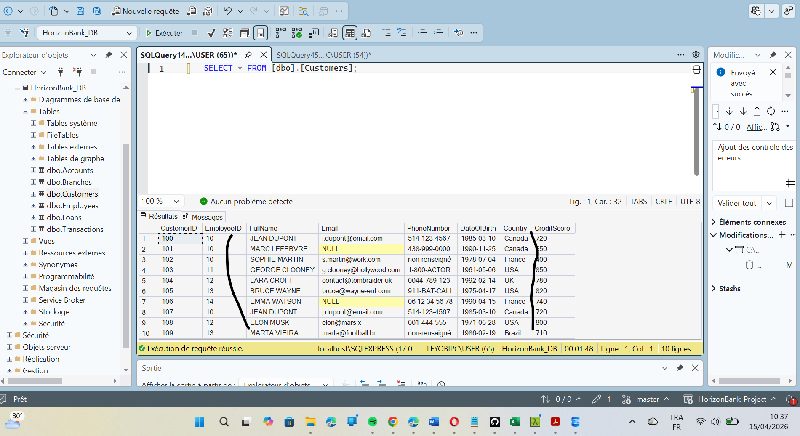
   

   
--Pour nos opérations de calculs , filtres et recherches il est important de donner aux valeur "NULL" une valeur utilisable pour que les fonctions puisse exécuter les commandes . Dans ce cas précis aux cellules des mails ayant des valeurs on va leur donner la valeur "non-renseigner@horizon.com" pour indiquer aux employés que ce n'est pas une valeur utilisable . En faisant un 3SELECT" le redu de notre script donne ceci: 
  

    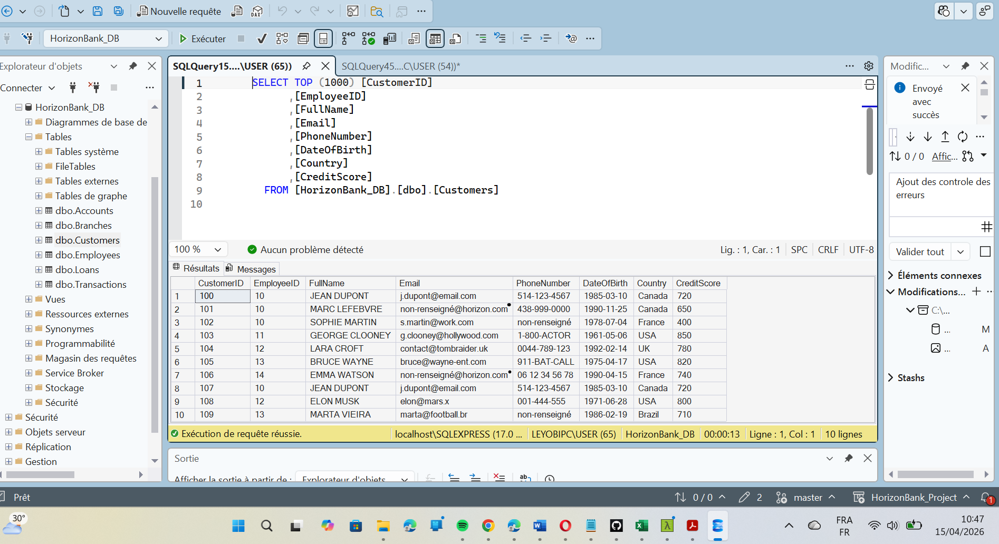
  

   
-- Les valeurs negatives présentes dans la balance des transaction veulent surement un retrait mais on a déjà une collone qui nous donne le type de transactions il ne sert à rien de garder les (-) car cela peut nous faucher dans nos calculs . L'excution du code et SELECT nous donne cette image: 
  

    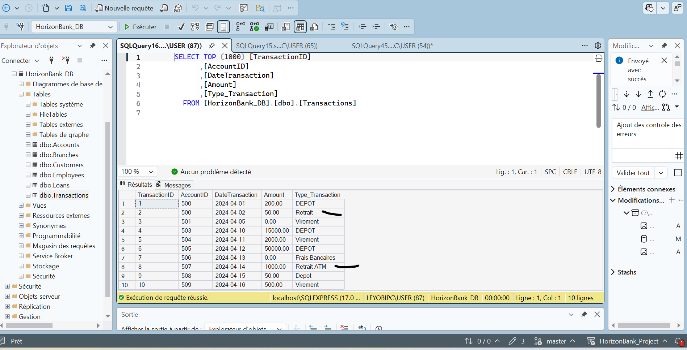
  

 
<b><h2>📊 PHASE 3 : Business Intelligence & Analyse (L'Extraction)</h2></b> 
Danc cette partie nous allons procéder à la l'analyse des données à disposition pour mettre en évidence les KPI. Cette partie se fera en 3 RAPPORTS : 
 
<b><h3>Rapport 1 : Performance des Agences</h3></b> 
La direction veut savoir la region qui rapporte le plus d'argent . L'objectif de cette partie sera de donner le <b>CHIFFRE D'AFFAIRE (CA)</b> de toutes les Agences de la banque HORIZON_BANK afin d'en deceler les plus rentables . 
La Performance des Agence se calcule en fonction des soldes client appartenant à ces Agences et ainsi la vu de SSMS nous donne le classement de celle ci 
  

    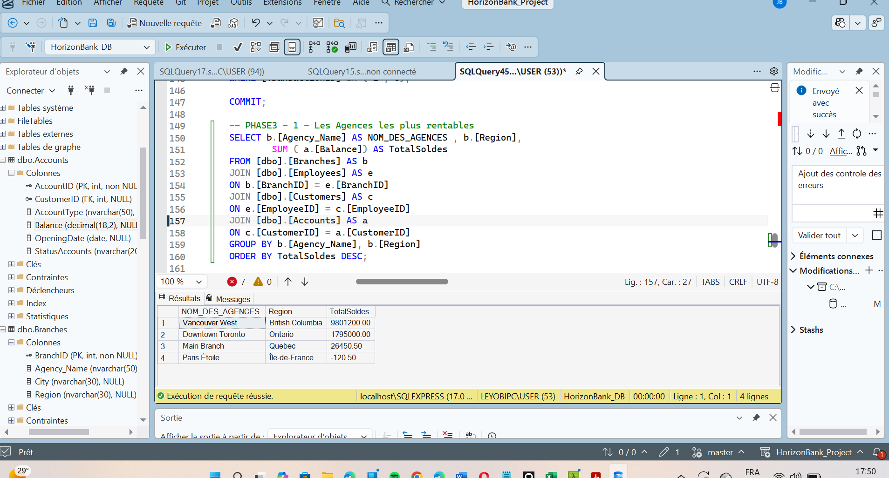
  

   
  ON va tranformer ce tableau en données exploitable a fin de mieux visualiser ces chiffres pour que le BOARD puisse mieux comprendre et pour cela on aura besoin d'un outil de visualisation comme EXCEL .  
Dans sun environement bancaire ou les données changent constament, ON va faire une laison EXCEL --> SQL SERVER pour que celle ci se mettent à jours de façon dynamique pour permettre une visualisation en temps réel.Cette figure montre d'ailleur le chargement  
  

    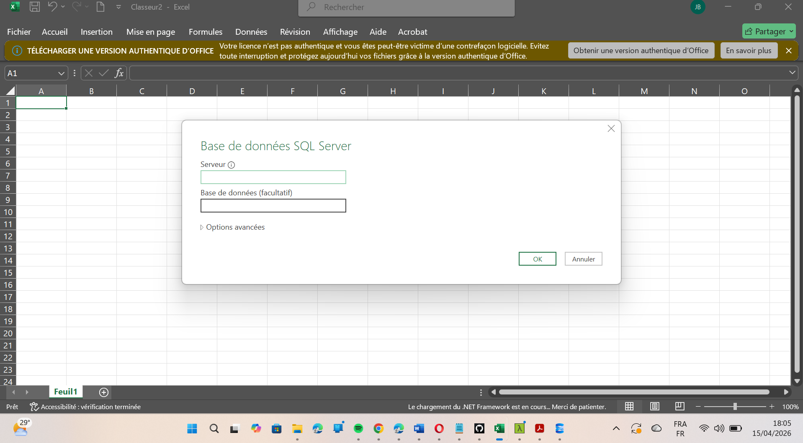
  

   
On va juste renommer les champs avec <b>POWER QUERY</b> avant de sles charger sur la feuille calcul  
  

    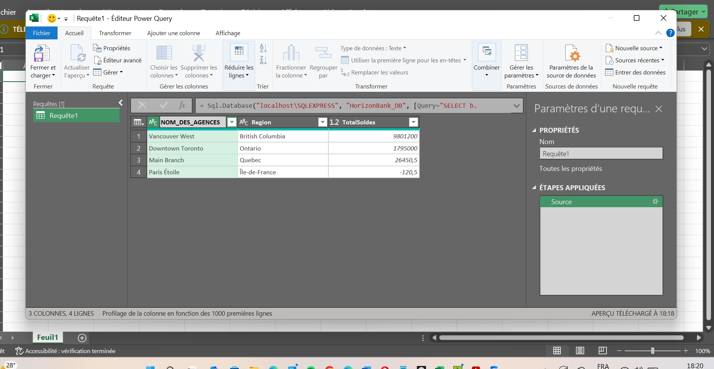
  

   
ON obtient le tableau croisé dynamique accompagné de son graphique  
  

    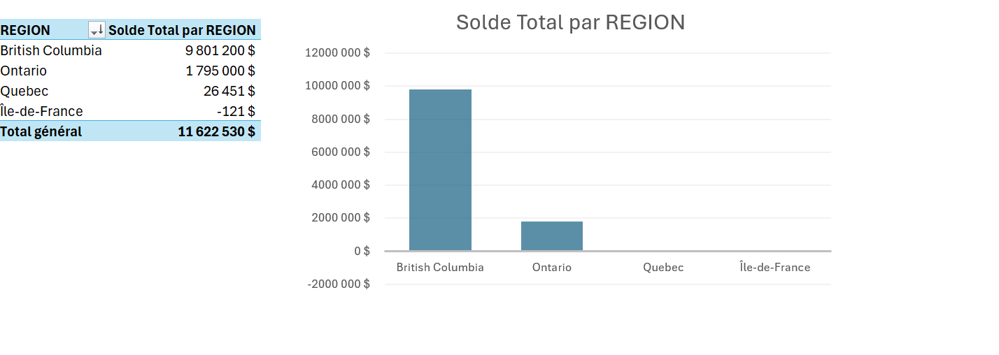
  

   
Cette analyse met en lumière une repartition géographique très inégale des fonds. La <b>Colombie-Britanique</b> domine largement le porte feuille avec près de 9,8 Millions $,réprésentant la vaste majorité des actifs. A l'opposé, la region ile-de-france présente un solde négatif , signalant des comptes débiteurs qui pourraient nécessiter une surveillance particulière en matière d'intégrité des données ou de gestion des risques. 
 
<b><h3>Rapport 2 : Segmentation des Clients</h3></b> 
Le BOARD veut par le biais de la direction marketing veut catégotiser les clients selon leut "CréditScore" . Pour ce faire , on va afficher les nom des client tels : 
* Si Score > 800 : 'Excellent' 
* Si Score entre 700 et 800 : 'Bon' 
* Si Score < 700 : 'À surveiller' 
Dans cette figure vous avez toutes les catégories de client en fonction des scores credits  
  

    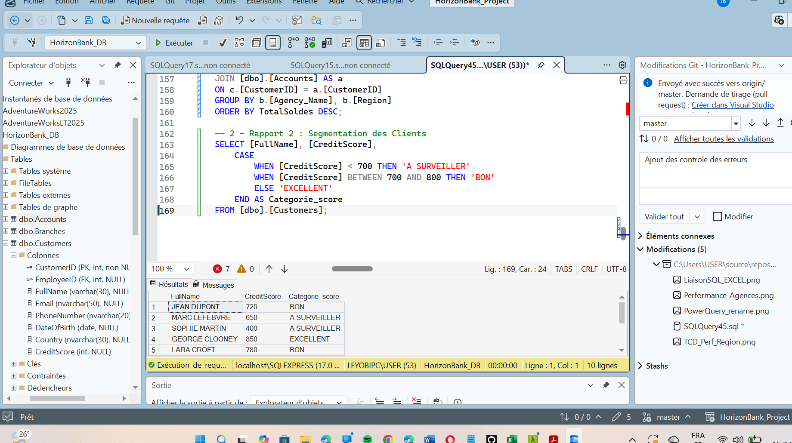
  

   
  Par le même proceder que le précédent , on a pu ressortir un TCD représentant les catégories de score en fonction du score crédit de chaque client  
    

      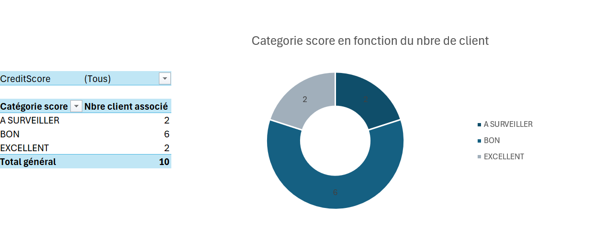
    

     
Ce graphique présente la segmention des clients par catégorie de score de crédit? On observe que 60% du portefeuille bénéficie d'un score BON , ce qui indique une base de clients majoritairement stable. Tputefois 20% de clients à "surveiller", constituant un segment à risque modéré qui nécessite une attention particulière pour prévenir d'éventuels défauts de paiement.
   
  <b><h3>Rapport 3 : Top Transactions par Client</h3></b> 
  La direction Marketing demande les plus grosses transaction de chaque client . Pour ce faire on a utiliser un des concept du code SQL pour arriver à ce rendu . Vu que l'analyse est centré sur le point de vu <b>Client</b> , cette partie sert à indentifier et catégoriser  les "gros mouvements clients" ou les client les clients avec les plus "gros mouvements" 
    

      
    

     
Après implémention et tranformation sur l'outil EXCEL on ce graphique qui montre les transactions les plus elevées par client  
  

    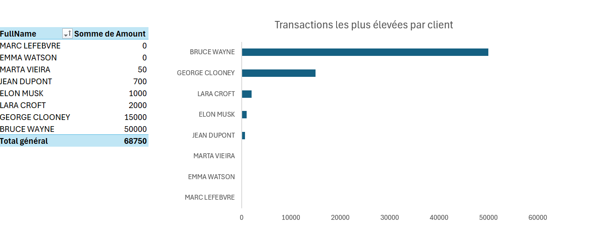
  

   
  Ce graphique présente la transaction maximal enregistrée pour chaque client. On observe une forte disparité entre les comptes, avec un <b>50 000</b> pour le client BRUCE WAYNE, tandis que les autres clients présentent des transactions plafonnées à des niveaux nettement inférieurs, suggérant des profils d'utilisateurs differents .
 
<b><h2> DASHBOARD</h2></b> 
  

    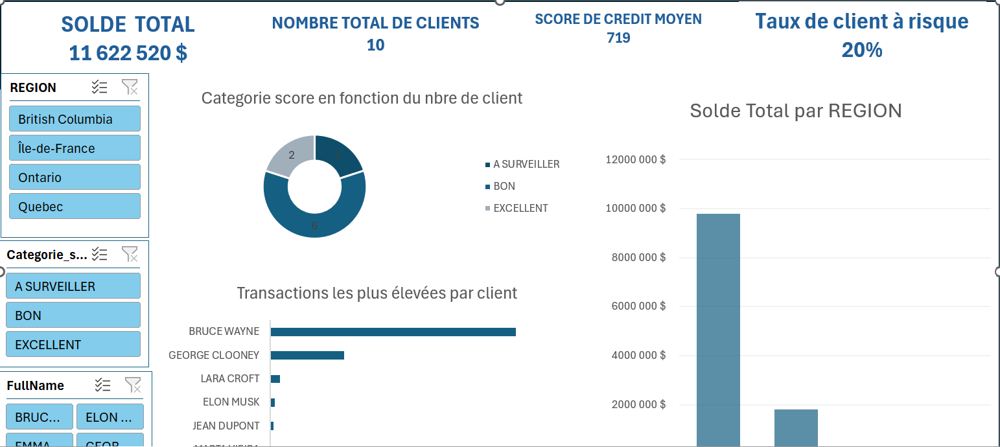
  

   
  
<b><h3></h3></b>📈 Résultats clés</h3></b> 
Fiabilité des données : 100% des doublons et erreurs de saisie ont été corrigés. 

Aide à la décision : Identification visuelle immédiate des 20% de clients à risque nécessitant une surveillance accrue.

Optimisation : Réduction du temps de reporting via des requêtes SQL automatisées.

  

 
