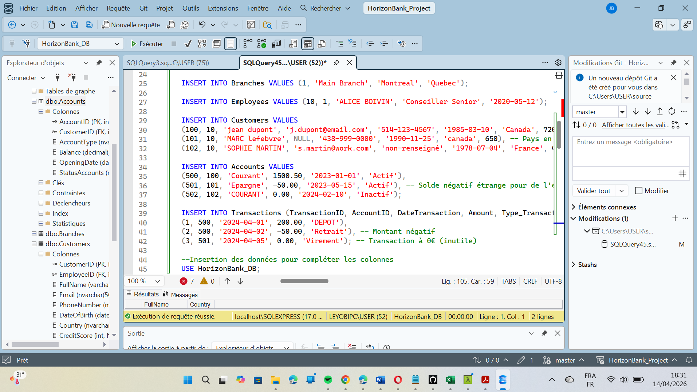
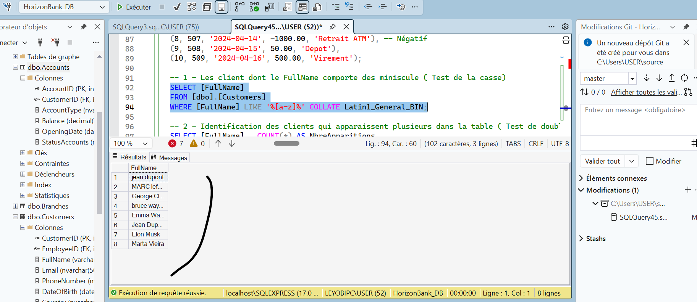
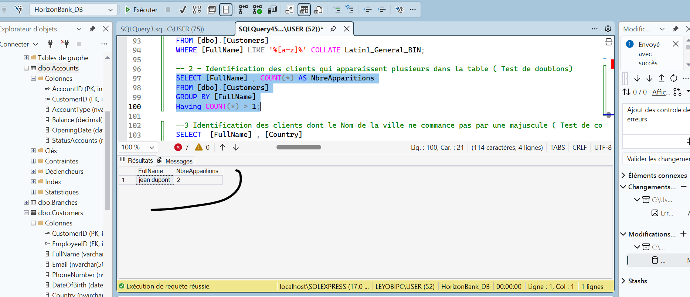
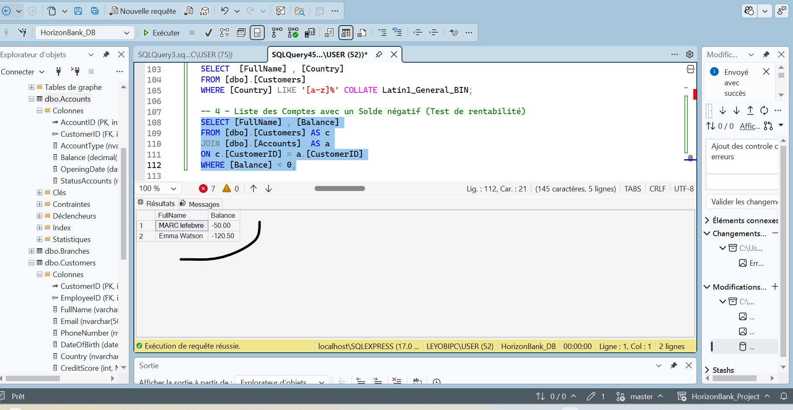

# HorizonBank_Project
<b><h2>🏦 Projet : "Horizon Banking Data Integrity & Insights"</h2></b> 
Phase 1 : Ingestion et Schéma (Le socle) 
Avant d'analyser, il faut construire. On vas devoir créer l'architecture capable de recevoir nos données clients, comptes et transactions. 
 
Compétences visées : DDL (Data Definition Language), Types de données, Contraintes d'intégrité. 
 
Phase 2 : Data Cleaning & Standardisation (Le nettoyage) 
C'est ici que 80% du travail d'un analyste se passe. Les données brutes contiennent des doublons, des formats de dates incohérents et des valeurs nulles critiques.
 
Compétences visées : DML (UPDATE, DELETE), Fonctions de chaînes, Gestion des NULLs.
 
Phase 3 : Business Intelligence & Analyse (L'extraction) 
Le board de la banque veut des réponses : Qui sont nos clients les plus rentables ? Quel est le volume de risque ?
 
Compétences visées : Agrégations complexes (GROUP BY), Jointures (JOIN), CTE (Common Table Expressions).
 
Phase 4 : Optimisation & Sécurité (La déontologie) 
Un analyste assermenté doit garantir que les requêtes sont rapides et que les données sensibles sont protégées.
 
Compétences visées : Indexation, Vues (Views).
 
<b><h3>📋 ÉTAPE 1 (Ingestion)</h3></b> 
Pour commencer, nous devons monter l'infrastructure de test sur SSMS. Nous allons créer une base de données nommée HorizonBank_DB et d'y intégrer six tables spécifiques.
 
Attention : C'est à nous de définir les types de colonnes appropriés (INT, VARCHAR, DECIMAL, DATE, etc.) et les Clés Primaires (PK) et les clés secondaires (FK)
 
1. Table Branches (Les Agences) 
BranchID (PK) 

Nom_Agence, Ville, Region 

2. Table Employees (Les Conseillers) 
EmployeeID (PK) 

BranchID (FK vers Branches) 

Nom_Complet, Poste, Date_Embauche 

3. Table Customers (Les Clients) 
CustomerID (PK) 

EmployeeID (FK vers Employees - Chaque client a un conseiller attitré) 

Nom_Complet, Email, Telephone, Date_Naissance, Pays, Score_Credit 

4. Table Accounts (Les Comptes) 
AccountID (PK) 

CustomerID (FK vers Customers) 

Type_Compte (Courant, Épargne, etc.) 

Solde (Attention au type de donnée pour la monnaie !),

Date_Ouverture, Statut 

5. Table Transactions (Les Flux) 
TransactionID (PK) 

AccountID (FK vers Accounts) 

Date_Transaction, Montant, Type_Transaction

6. Table Loans (Les Prêts - Nouvelle table cruciale) 
LoanID (PK) 

CustomerID (FK vers Customers) 

Montant_Pret, Taux_Interet, Duree_Mois, Date_Debut, Statut_Pret
 
Livrable attendu pour cette tâche : 
Le script SQL complet (DDL) de création de ces tables. On va s'assurer que leses choix de types de données sont optimaux pour une banque internationale (notamment pour les montants financiers et la précision). 
  

    
  

 
<b><h3> 1-📋 Diagnostic Expert (Phase 2) </h3></b> 
Maintenant que nous avons de la donnée, le Board veut un "Data Quality Report". Cette partie est juste une découverte des données . Savoir quel sont les valeurs des colonnes qu'on peut nettoyer pour rendre les fichiers exploitables .Nous allons utiliser les connaissances (SELECT, JOIN, WHERE) pour sortir les listes suivantes:
 
Le test de la casse (Case Sensitivity) : Trouvez tous les clients dont le FullName comporte des minuscules  
  

    
      

 
Le test des doublons : Identification des noms de clients qui apparaissent plus d'une fois dans la table (même s'ils ont un CustomerID différent).
      

        
  

 
Le test de cohérence géographique :
Affichez les clients dont le pays n'est pas écrit avec la première lettre en Majuscule seulement (ex: 'france').
  

      
  

 
Le test de rentabilité (Accounts) :
Liste les comptes qui ont un solde (Balance) négatif.
  

    
  

